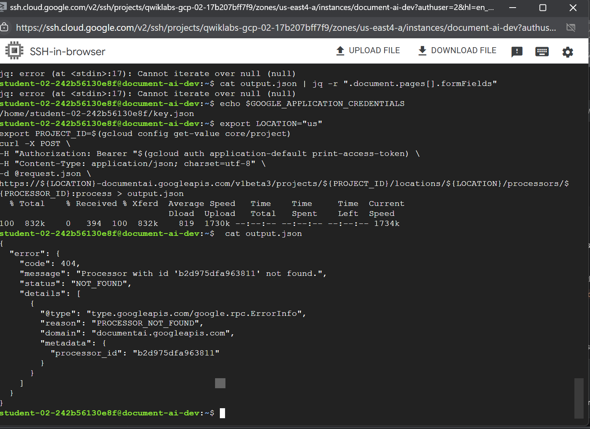

## Day 016 – 021: 2025/07/16 to 2025/07/21

Day 016

- Learned about SAP & ABAP foundations. I was expecting some coding, but so far there wasn’t any. It's more about understanding the concepts and how to navigate the SAP system.
- Joined Google Cloud Arcade 2025. I’m mainly seeking the community aspect tbh since I’ve tried GCP before. Still waiting for the confirmation email, so I just explored the website, the gamification looks pretty interesting :D

Day 017

- I didn't get a chance to code, I spent literally the whole day working on tasks and a mini project for another program I joined (Link Women 2025 - LinkedIn x UN Women).
- Also got my confirmation email for Google Cloud Arcade, so I redeemed my code and set up the learning path I plan to follow.

Day 018

- I tried to start coding using SAP, already installed Eclipse and ADT, but I couldn't create a free trial BTP acc. I got stuck on the verification step for an hour which the issue was absolutely on their end. I finally decided to email support and they fixed it by letting me to skip that step so I didn't have to verify again. But I got stuck again on the ToS page, which was also another issue on their end :) I clicked the daym checklist button to agree but it led me to a plain white page no UI no nothing just "HTTP Status 400". I asked Gemini and she said it's such a common issue, and I was like really? o_O okay, so the solution was to delete the cache and everything else, which reset ALL my passwords and accounts including email etc, literally everything in the browser. I had to do that and it wasn't fun at all. I need to be more patient but that was the line, I decided to switch to Arcade instead :)
- Tried to do the 1st week Trivia. There are 4 labs. The first lab was about NLP and it was straightforward. The second lab was about Document AI Processor, which should be easy, but I got stuck on this error. It's 10:04pm now and I'm too eepy to continue. I'll try again tomorrow InshaAllah. 

---

**Progress Summary:**

- :D

**Time spent:** :^)

**Thoughts:**
@\_@

**Link(s) to Work:** [^-^]()

**Up Next:**

- UwU
