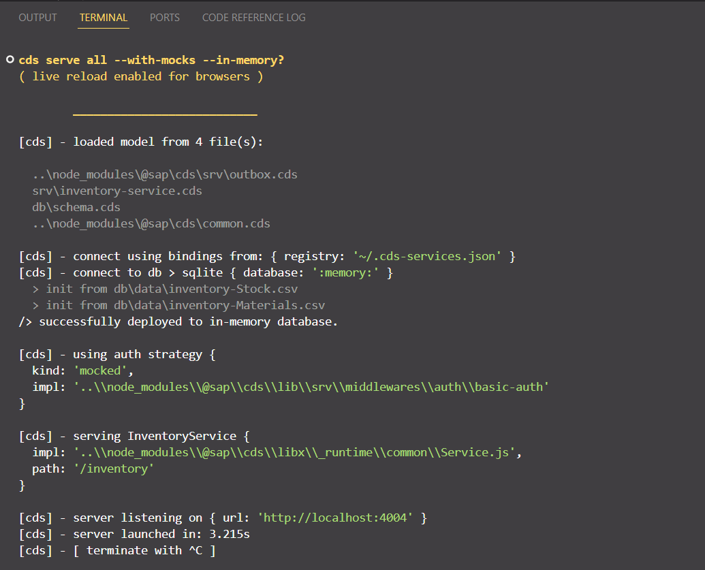
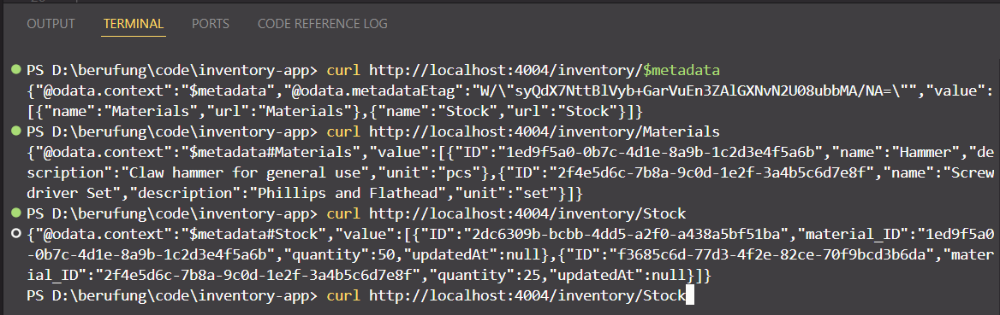

# Day 2: Define Data Model (CDS) 📊

## Objective

Define a data model for the inventory management system using SAP CAP's Core Data Services (CDS), create sample data, and test the model locally.

## Tasks

1. ✅ **Create Data Model**:
   - ~~In your CAP project, create a new file `db/schema.cds`.~~
   - ~~Define `Materials` and `Stock` entities with appropriate fields and relationships using CDS.~~
2. ✅ **Add Sample Data**:
   - ~~Create a CSV file `db/data/my.inventory-Materials.csv` to populate the `Materials` entity with sample data.~~
   - ~~Create a CSV file `db/data/my.inventory-Stock.csv` for the `Stock` entity.~~
3. ✅ **Test Data Model Locally**:
   - ~~Run `cds watch` in the terminal to start a local server with an in-memory SQLite database.~~
     
   - ~~Verify that the data model and sample data are correctly exposed via the local service.~~
     

## Tools

- **VS Code**: For editing CDS and CSV files.
- **SAP CDS Language Support**: VS Code extension for syntax highlighting and CDS autocompletion.
- **Terminal**: To execute `cds watch` and monitor the local server.

## Deliverables

- **Data Model**: `db/schema.cds` with `Materials` and `Stock` entities.
- **Sample Data**: `db/data/my.inventory-Materials.csv` and `db/data/my.inventory-Stock.csv`.
- **Local Test**: Running CAP service with `cds watch` and verified data access.
