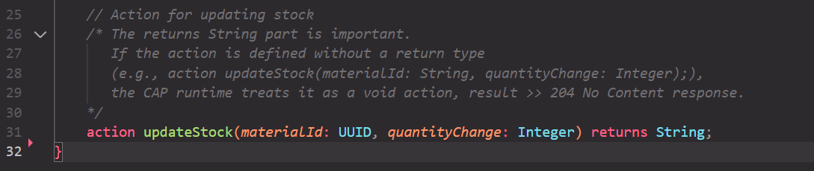
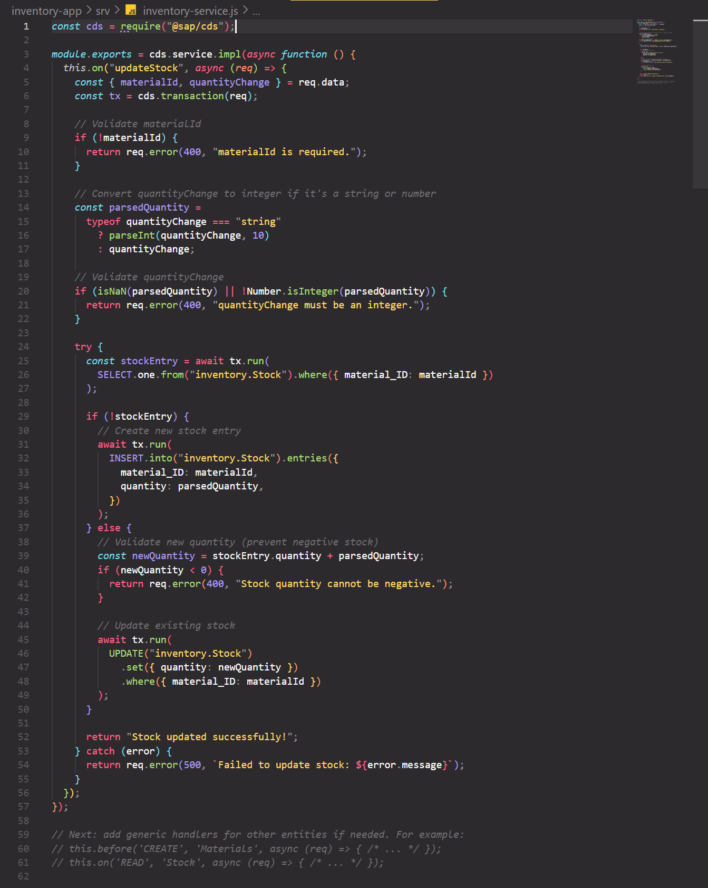
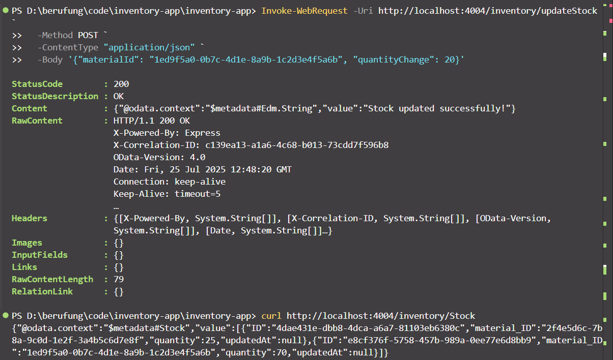
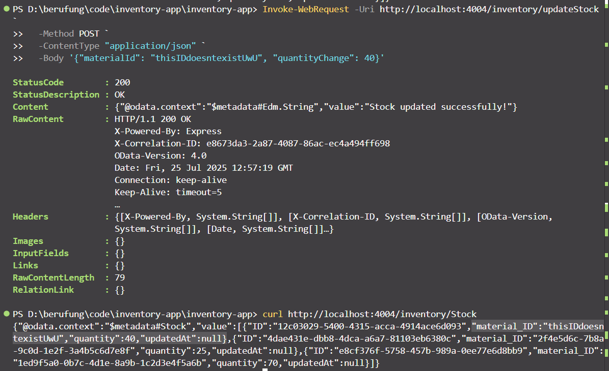
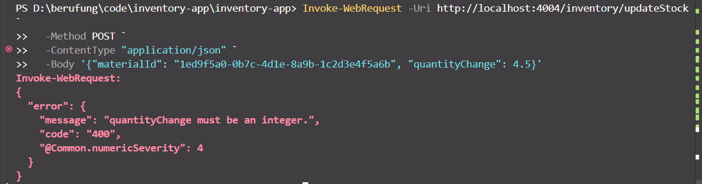
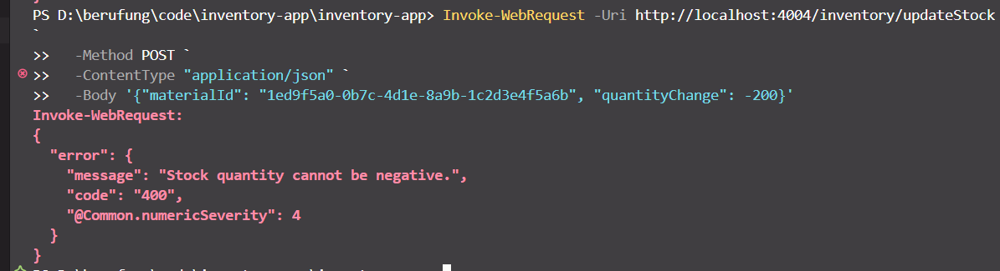

### Day 3 (2025/07/25): Develop CAP Service (Backend Logic & OData Exposure) ⚙️

**Objective:** Create a functional CAP (Cloud Application Programming) service with OData endpoints for inventory management, including a service definition, backend logic for stock updates, and local testing.

**Tasks:**

1.  ✅ **Create Update Stock action (`srv/inventory-service.cds`):**

    - ~~Include an action for updating stock with `materialId` and `quantityChange` as parameters.~~
      

2.  ✅ **Implement Service Logic (`srv/inventory-service.js`):**

    - ~~Implement the `updateStock` action, handling the logic for adjusting stock quantities.~~
    - ~~Include basic validation for stock updates (e.g., ensuring `quantityChange` is an integer).~~
    - ~~Consider the scenario where a stock entry for a given `materialId` might not exist and implement logic to either create it or handle the error appropriately (creating is a simpler approach for now).~~

    

3.  ✅ **Test Service Locally:**

    - ~~Run the CAP service locally (using `cds watch`).~~
    - ~~Test the OData endpoints:~~
      - `http://localhost:4004/inventory/Materials` (for Material entities)
      - `http://localhost:4004/inventory/Stock` (for Stock entities)
    - ~~Test the `updateStock` action by sending a POST request to `http://localhost:4004/inventory/updateStock` with a payload like:~~
      ```json
      {
        "materialId": "YOUR_MATERIAL_UUID",
        "quantityChange": 10
      }
      ```
      - Scenario 1: `materialId` exists, `quantityChange` is an integer, stock is positive >> Stock is updated ✔️
        
      - Scenario 2: `materialId` doesn't exist, `quantityChange` is an integer, stock is positive >> new stock entry is created ✔️
        
      - Scenario 3: `materialId` exists, `quantityChange` isn't an integer, stock is positive >> 400 status with error message ✔️
        
      - Scenario 4: `materialId` exists, `quantityChange` is an integer but exceeds the current stock >> 400 status with error message ✔️
        

**Tools:**

- VS Code
- SAP CDS Language Support Extension

**Deliverable:**

- A functional CAP service with OData endpoints for `Materials` and `Stock` entities.
- A working `updateStock` action, tested locally.
