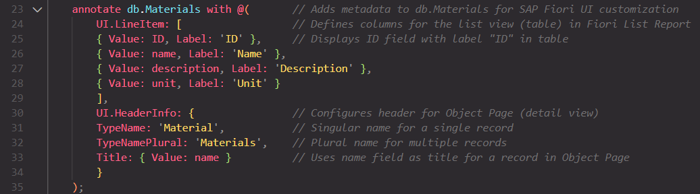
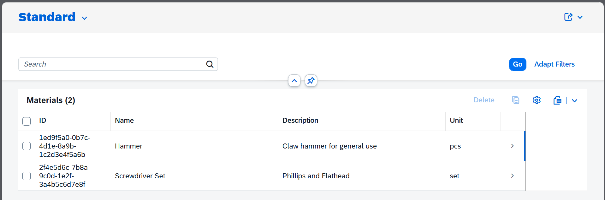

### Day 4 (2025/07/27): Create Basic Fiori Elements UI - Materials List Report 🎨

**Objective**: Generate and test a Fiori Elements List Report Object Page for the `Materials` entity, connected to your CAP service, with basic annotations for an optimized UI.

**Tasks**:

1. ✅ **Set Up Fiori Tools**
2. ✅ **Generate Fiori App**

   - ~~Choose **List Report Object Page** template.~~
   - ~~**Data Source**: Select **Use a Local CAP Project**, point to CAP project root (`package.json` location).~~
   - ~~**Service and Entity**: Select `InventoryService` and `Materials` entity.~~
   - ~~**Configuration**:~~
     - ~~Module name: `materials-manage`~~
     - ~~Title: "Materials Management"~~
     - ~~UI folder: `app/inventory/`~~

3. ❌ **Add Basic Annotations**:

   - Location: `srv/inventory-service.cds`.
   - Add basic UI annotations to enhance the List Report display, e.g.:
     ```cds
     annotate InventoryService.Materials with @(
         UI.LineItem: [
             { Value: materialID },
             { Value: materialName },
             { Value: quantity },
             { Value: unitPrice }
         ]
     );
     ```
   - These annotations define which fields appear in the list view. Adjust fields based on your `Materials` entity structure.

4. ❌ **Configure the App**:

   - After generation, check the `app/inventory/materials-manage/` folder for the generated app files.
   - Verify that `manifest.json` in the app folder points to the correct OData service (e.g., `InventoryService`).
   - If needed, manually adjust `manifest.json` to ensure proper service binding.

5. ❌ **Run and Test Locally**:
   - Navigate to the app folder: `cd app/inventory/materials-manage`.
   - Install dependencies: `npm install`.
   - Start the app: `npm start` to launch the Fiori preview.
   - Alternatively, from the CAP project root, run `cds watch` to start the CAP server, then use the Fiori Tools preview in VS Code to test the UI.
   - Verify the List Report displays the `Materials` entity data correctly, with fields from the annotations.

**Tools**:

- VS Code with SAP Fiori Tools Extension.
- SAP CAP toolkit (ensure `cds` is installed globally via `npm install -g @sap/cds-dk`).

**Deliverable**:

- A functional Fiori Elements List Report Object Page in `app/inventory/materials-manage/`, connected to `InventoryService`, with basic UI annotations and tested locally.

### Day 5 (2025/07/29)

I was supposed to work on the Fiori Elements UI for the `Stock` entity, but I got sidetracked by a personal project ([cute habit tracker on Google Sheets](https://x.com/laiflonglearner/status/1950223195774341580)). I count that as coding because it does involve coding, I also felt it was necessary (and I just don't want to lose my streak hahaha). I'll get back on track ASAP 👀

### Day 6 (2025/07/30): Failed tasks from Day 4 and Create Fiori Elements UI for Stock Entity 🛠 ️

Tasks from Day 4 that I didn't complete:

1.  ✅ Add Basic Annotations

- ~~Location: `srv/inventory-service.cds`.~~
- ~~Add basic UI annotations to enhance the List Report display, e.g.:~~
  ```cds
  annotate InventoryService.Stock with @(
      UI.LineItem: [
          { Value: materialID },
          { Value: quantity },
          { Value: lastUpdated }
      ]
  );
  ```
- ~~These annotations define which fields appear in the list view. Adjust fields based on your `Stock` entity structure.~~
  

2.  ✅ **Configure the App**
- ~~After generation, check the `app/inventory/materials-manage/` folder for the generated app files.~~
- ~~Verify that `manifest.json` in the app folder points to the correct OData service (e.g., `InventoryService`).~~
- ~~If needed, manually adjust `manifest.json` to ensure proper service binding.~~

3. ✅ **Run and Test Locally**
- ~~Start the app: `npm start` to launch the Fiori preview.~~
- ~~Alternatively, from the CAP project root, run `cds watch` to start the CAP server, then use the Fiori Tools preview in VS Code to test the UI.~~
- ~~Verify the List Report displays the `Materials` entity data correctly, with fields from the annotations.~~


### 2025/07/31: taking a break again, shared a detailed update [here](https://x.com/laiflonglearner/status/1950951360859611159)
